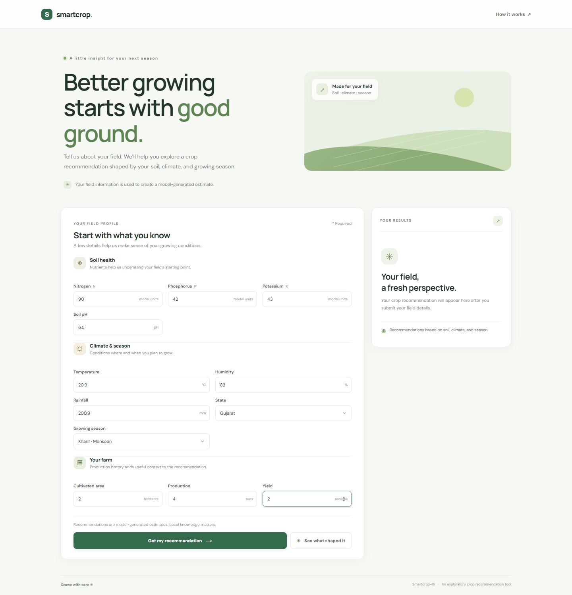
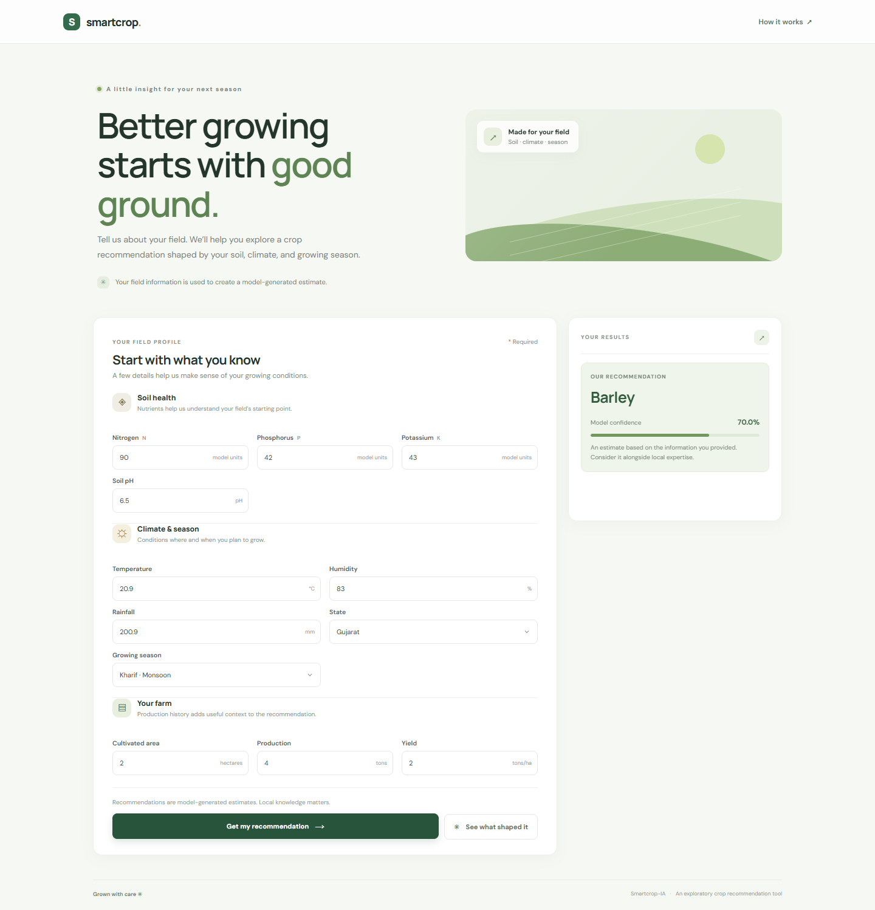
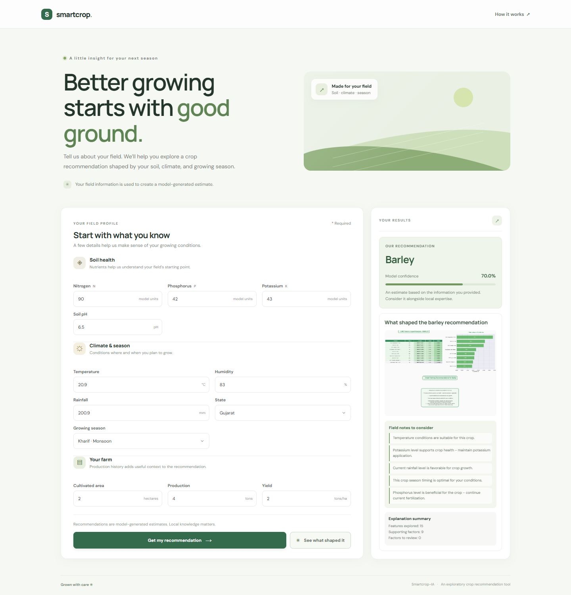
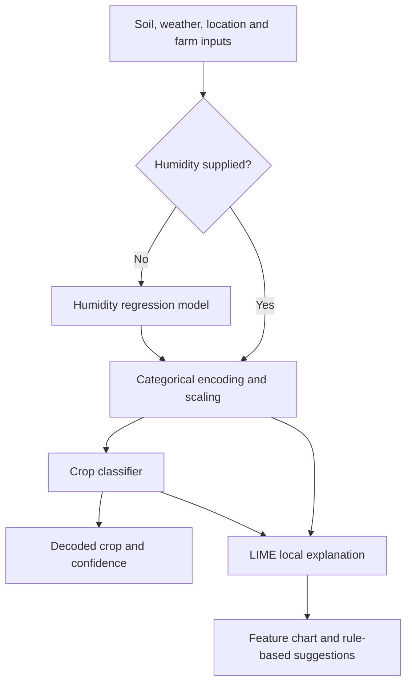

<div align="center">

# 🌱 Smartcrop-IA

### Crop recommendations with explainable machine learning

Turn soil, weather, and farm data into a crop prediction — then explore the features behind it.


[Preview](#preview) · [Quick start](#quick-start) · [API](#api) · [How it works](#how-it-works)

</div>

## Overview

**Smartcrop-IA** is a crop recommendation prototype built with a FastAPI backend, pretrained scikit-learn models, and a browser interface. It combines soil nutrients, environmental conditions, location, season, and farm production data to predict a crop and report its model confidence.

The interface is titled **Smart Crop-XAI**. Its **Explain with AI** action uses LIME (Local Interpretable Model-agnostic Explanations) to visualize feature contributions and display rule-based farming suggestions.

## Preview

Screenshots of the local application using the sample inputs below, with temperature rounded to 20.9 ?C for the form?s 0.1-degree step.



*Enter soil, weather, location, and farm details in one form.*



*The prediction view displays the recommended crop and classifier confidence.*



*An actual explanation response from the bundled app. The reference samples are synthetic; see the limitations below.*

## Features

- **Crop prediction:** run the bundled classifier on farm and environmental inputs.
- **Confidence score:** display the predicted class probability as a percentage.
- **Optional humidity estimation through the API:** omit humidity to estimate it with the bundled regression model.
- **LIME explanations:** inspect a feature-impact chart, feature summaries, and generated suggestions.
- **Browser interface:** submit predictions and explanation requests without writing API calls.
- **Interactive API documentation:** explore request schemas and endpoints through FastAPI's Swagger UI.

## Quick start

### 1. Clone the repository

```bash
git clone https://github.com/touatifatima/Smartcrop-IA.git
cd Smartcrop-IA
```

### 2. Create a Python 3.11 environment

Use Python 3.11 with the repository's pinned NumPy and scikit-learn versions to avoid compatibility problems with the serialized models.

**Windows PowerShell**

```powershell
py -3.11 -m venv .venv
.\.venv\Scripts\Activate.ps1
```

**macOS / Linux**

```bash
python3.11 -m venv .venv
source .venv/bin/activate
```

### 3. Install dependencies

```bash
python -m pip install --upgrade pip
python -m pip install -r requirements.txt
python -m pip install "fastapi[standard]" matplotlib
```

The FastAPI entry in `requirements.txt` is currently commented out, so the extra installation command is required.

### 4. Start the app

Run this command **from the repository root** so the app can find `models/` and the frontend files:

```bash
python -m uvicorn main:app --reload --host 127.0.0.1 --port 8000
```

| Page | Local URL |
| --- | --- |
| Web application | http://localhost:8000/ |
| Swagger UI | http://localhost:8000/docs |
| ReDoc | http://localhost:8000/redoc |

The frontend uses the current website origin as its API address by default, so the bundled FastAPI app works locally without extra settings. If you host the frontend separately, configure the API origin immediately before `script.js` in `index.html`:

```html
<script>window.SMARTCROP_API_URL = "https://your-api-host.example";</script>
<script src="./script.js"></script>
```

The API must allow requests from your frontend's domain. The browser uses this address for predictions, explanations, and the API documentation link.

## Try a prediction

1. Open the web application.
2. Enter the sample values below and select **Gujarat** and **Kharif**.
3. Click **Predict Crop** to see the predicted class and confidence.
4. Click **Explain with AI** to generate the LIME visualization and suggestions.

| Input | Example | Meaning |
| --- | --- | --- |
| Nitrogen (`N`) | 90 | Soil nitrogen input |
| Phosphorus (`P`) | 42 | Soil phosphorus input |
| Potassium (`K`) | 43 | Soil potassium input |
| Temperature | 20.87 | Degrees Celsius |
| Rainfall | 200.9 | Millimeters |
| pH | 6.5 | Soil acidity / alkalinity |
| Humidity | 83 | Relative humidity (%) |
| State | `gujarat` | State category recognized by the encoder |
| Crop type | `kharif` | Growing season category |
| Area | 2.0 | Hectares |
| Production | 4.0 | Tons |
| Yield | 2.0 | Tons per hectare |

These are demonstration inputs from `r.md`, not recommended agronomic target values. Nutrient units are not specified in the repository; inputs should match the model's training conventions. The browser requires humidity, while the API can estimate it when omitted or set to `null`.

## API

### Endpoints

| Method | Route | Purpose |
| --- | --- | --- |
| `GET` | `/` | Serve the web interface |
| `POST` | `/predict` | Return crop, confidence, and humidity |
| `POST` | `/explain` | Return LIME feature contributions, advice, and a base64 PNG |
| `GET` | `/explain-html/{crop_id}` | Informational placeholder directing users to `/explain` |

### Example request

Use **Try it out** in `/docs`, or save this payload as `sample.json`:

```json
{
  "N": 90,
  "P": 42,
  "K": 43,
  "temperature": 20.87,
  "rainfall": 200.9,
  "ph": 6.5,
  "State_Name": "gujarat",
  "Crop_Type": "kharif",
  "Area_in_hectares": 2.0,
  "Production_in_tons": 4.0,
  "Yield_ton_per_hec": 2.0,
  "Humidity_calculated": 83
}
```

```bash
curl -X POST http://localhost:8000/predict -H "Content-Type: application/json" --data-binary @sample.json
```

In Windows PowerShell, use `curl.exe` in place of `curl`.

The prediction response contains:

| Field | Meaning |
| --- | --- |
| `predicted_crop` | Decoded crop label |
| `confidence` | Predicted class probability, between 0 and 1 |
| `humidity_calculated` | Provided or estimated humidity |

Send the same payload to `/explain` for `feature_importance`, `top_advice`, `summary`, and `visualization.image_base64`. Check the response's `status`: explanation failures can be returned as `status: "error"` inside a successful HTTP response.

## How it works



The saved pipeline uses a **RandomForestRegressor** for humidity, a **ColumnTransformer** with categorical one-hot encoding, a **StandardScaler**, a **BaggingClassifier** for crop prediction, and a **LabelEncoder** to recover crop names.

### Model artifacts

The five inference artifacts are included in `models/`:

| File | Role |
| --- | --- |
| `humidity_model.pkl` | Estimate missing humidity |
| `column_transformer.pkl` | Encode and arrange input features |
| `standard_scaler.pkl` | Scale transformed features |
| `crop_prediction_model.pkl` | Predict crop classes |
| `label_encoder.pkl` | Convert predicted class IDs into crop names |

The app also looks for `models/X_train.pkl` and `models/feature_names.pkl`, which are **not included**. Without them, it initializes dummy reference data; the LIME helper then generates synthetic samples around the input when feature dimensions differ. Treat those explanations as demonstrations, not explanations grounded in the original training distribution.

## Project structure

```text
Smartcrop-IA/
├── main.py                     # FastAPI app, model loading and routes
├── index.html                  # Crop input form
├── style.css                   # Interface styling
├── script.js                   # API requests and result rendering
├── dzLime/
│   ├── __init__.py
│   └── lime.py                 # LIME explanations, charts and advice
├── models/                     # Five pretrained inference artifacts
├── docs/screenshots/           # README screenshots
├── test.ipynb                  # Model loading and inference exploration
├── r.md                        # Example input values
├── requirements.txt            # Python dependencies
└── README.md
```

## Current limitations

- **Model evaluation:** the repository does not provide a training dataset, a complete training pipeline, or a reproducible evaluation report. Prediction confidence is not a measured accuracy score.
- **Explanations:** synthetic reference data limits interpretation. Farming suggestions are rules derived from local feature contributions, not causal recommendations or a generative AI response.
- **Input coverage:** state and season values must match the saved encoder. The API validates types but does not enforce agronomic ranges.
- **Deployment:** the app mounts the repository root as a static directory and allows all CORS origins. Before public deployment, serve only intended frontend assets and restrict origins.

## Troubleshooting

| Symptom | What to check |
| --- | --- |
| `No module named fastapi` or `uvicorn` | Activate the environment and install `"fastapi[standard]"`. |
| Model loading fails | Start from the repository root and confirm all five `.pkl` files exist. |
| NumPy / scikit-learn installation or pickle errors | Use Python 3.11 and the pinned versions in `requirements.txt`. |
| The form loads but prediction fails | Confirm the API is running on port 8000 and Axios loaded successfully. |
| Unknown category error | Use the lowercase state and season values supplied by the form. |
| Training data warning at startup | Expected with the bundled files; see the explanation limitations above. |

## Contributing

Issues and pull requests are welcome. Useful improvements include adding reproducible model evaluation, restoring the original LIME reference data, validating input ranges, and making the API base URL configurable.

For a bug report, include your Python version, reproduction steps, and a sample request.

## Author

Created by [Fatima Touati](https://github.com/touatifatima).

Project: [Smartcrop-IA](https://github.com/touatifatima/Smartcrop-IA) · [Companion website](https://ocbbpaod.gensparkspace.com/)

## License

No license file is currently included in this repository.
